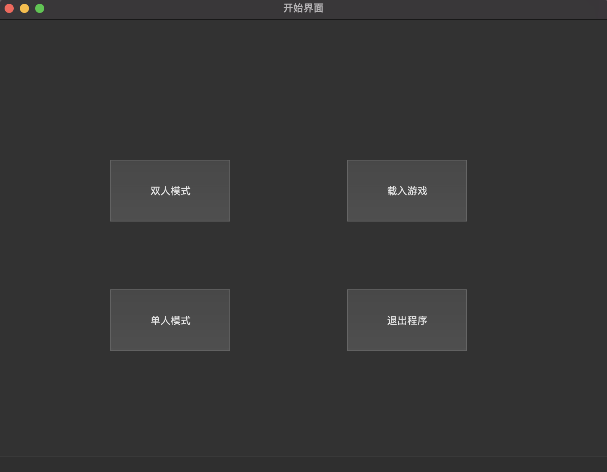
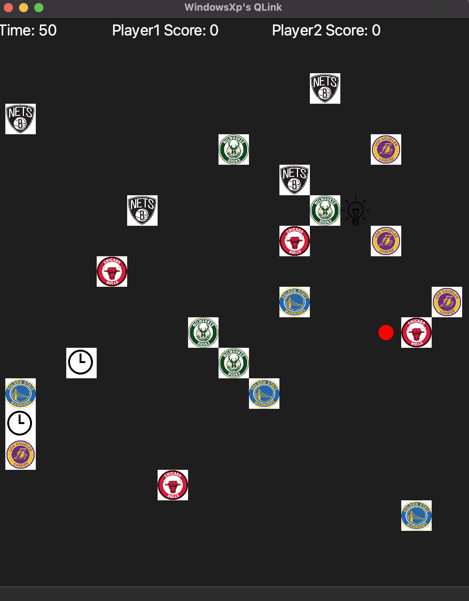

# QLink
## Overview
A RPG link game built with Qt5. So if you want to play just clone this repo and build it with Qt.

This is also a project of SE127:Software basic practice, you may refer to [QLink](./doc/QLink.pdf) for a detailed requirement list.

> Although I got 99/100, it's definitely not bug-free and the UI design really needs some improvement.

## Some screen shots

